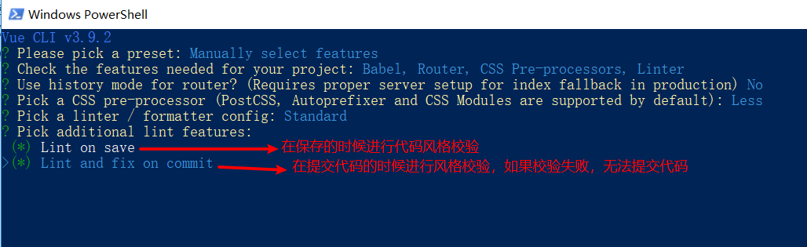

# vue脚手架的使用

## 脚手架的意义

- 脚手架是开发**现代web应用**的必备
- 充分利用`webpack`，`babel`，`eslint`等工具辅助项目开发
- 开箱即用，零配置，无需手动配置繁琐的工具即可使用
- vue脚手架还提供了配套的图形管理界面，用于创建，开发和管理你的项目

## vue脚手架使用

+ 初始化命令

```bash
# 全局安装 vue命令
yarn global add @vue/cli
或者
npm install -g @vue/cli
# 初始化项目
vue create hello-world
```

+ 选择预设


+ 选择项目的功能

`按空格进行选择，按回车进行下一步`


+ 选择路由的风格


+ 选择css预处理语言


+ 选择代码规范


+ 选择校验规则



+ 配置文件的生成方式


+ 保存配置


+ 给预设起名字


+ 启动项目（项目根目录下）

```bash
yarn serve
```

## webpack配置

vue已经提供了webpack的默认配置，也可以通过在根目录中创建`vue.config.js`文件添加自己的配置

```js
// 自动打开浏览器
module.exports = {
  devServer: {
    open: true
  }
}
```


## 项目目录说明

+ `.editorcofnig` 需要给vscode安装要给插件`EditorConfig`
+ `eslintrc`eslint的配置文件，一般不用手动配置
+ `.gitignore` git的忽视文件


# 单文件组件

## 基本概念

> **single-file components(单文件组件)** ，文件扩展名为 `.vue` 的文件

[单文件组件文档](https://cn.vuejs.org/v2/guide/single-file-components.html)

优势：

- [完整语法高亮](https://github.com/vuejs/awesome-vue#source-code-editing)
- [CommonJS 模块](https://webpack.js.org/concepts/modules/#what-is-a-webpack-module)
- [组件作用域的 CSS](https://vue-loader.vuejs.org/zh-cn/features/scoped-css.html)

单文件组件的结构说明

```vue
<template>
  <div>
    <h1>这是单文件组件的模板内容</h1>
  </div>
</template>

<script>
// 这是组件的js代码
export default {
  data () {
    return {
      msg: 'hello vue'
    }
  }
}
</script>

<style>
/* 这是单文件组件的样式 */
h1 {
  color: red;
}
</style>
```

